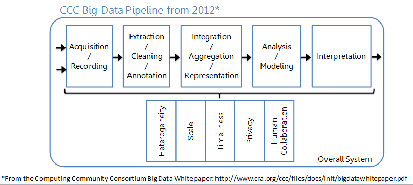
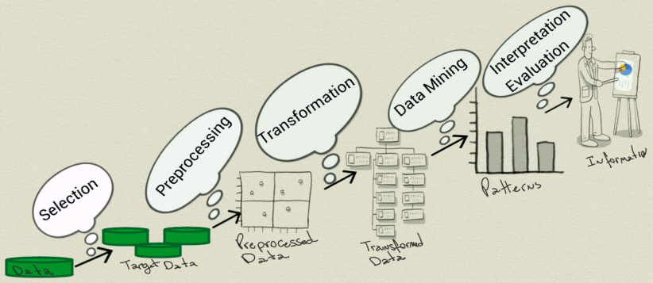
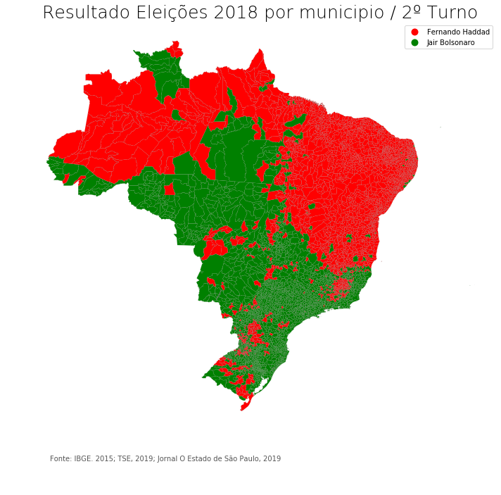
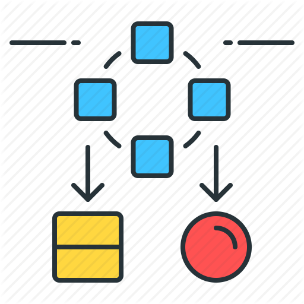

### São Paulo 11  de Julho 2019
# Aprendendo Machine Learn

**Testes**
$$
\hat{y} = \theta_0 + \theta_1 x
$$

==========

#### Sobre o projeto
Projeto criado para aprender **Machine Learn** e técnicas como Data Science utilizando R, Python, Julia e suas bibliotecas como Pandas, Matplotlib e Numpy. 
Utilizando [Anaconda](https://anaconda.org)
## Pipeline Big Data  
  
  
[Pipeline Big Data](notebooks/PipelineBigData.ipynb)
## Plotando dados com Matplotlib  
  

  
[Resultado das Eleicões 2º Turno por Municipio](notebooks/eleicoes2018_resultado_por_municipio.ipynb)

[Using Matplotlib](notebooks/UsingMatplotlib.ipynb)
## Selecting Data for Modeling
 
  
[Data Modeling](notebooks/DataModeling.ipynb)

## Pytorch
### Uma biblioteca de Deep Learn do Facebook
 
  
[Pytorch](notebooks/pytorch_mario_filho_live.ipynb) 
